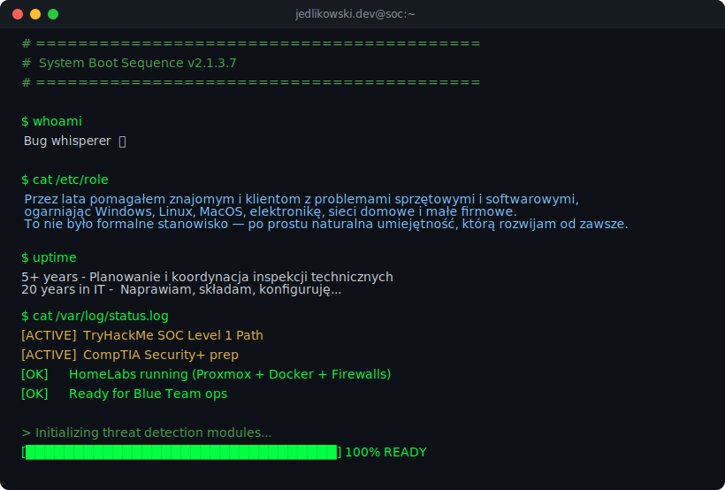
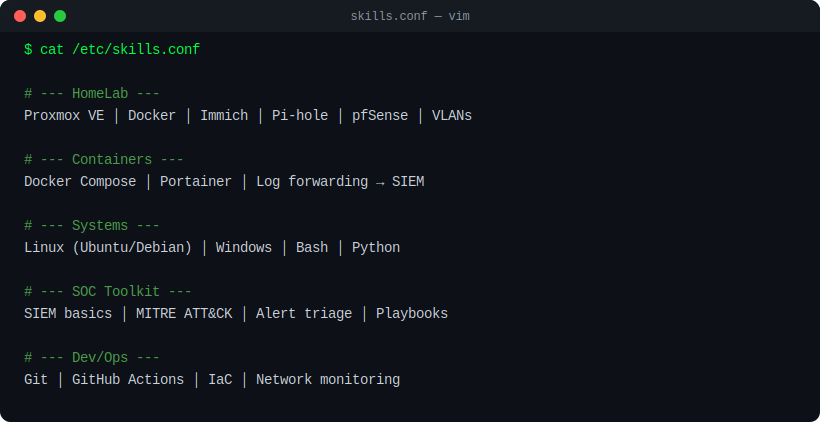
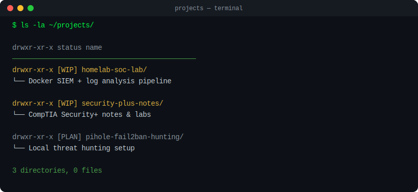
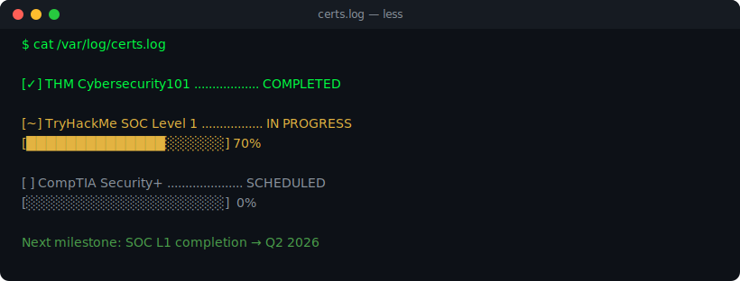

<div align="center">

<!-- ═══════════════ NAVIGATION ═══════════════ -->

[](https://jedlikowski.dev)
[](https://www.linkedin.com/in/dariusz-jedlikowski-177ab91b2/)
[](mailto:kontakt@jedlikowski.dev)


***

<!-- ═══════════════ HEADER ═══════════════ -->



***


<!-- ═══════════════ SKILLS ═══════════════ -->



***

<!-- ═══════════════ PROJECTS ═══════════════ -->



***

<!-- ═══════════════ CERTIFICATIONS ═══════════════ -->



***

<!-- ═══════════════ FOOTER ═══════════════ -->

```
root@soc:~# echo "Thanks for visiting"
Thanks for visiting
root@soc:~# █
```

</div>
